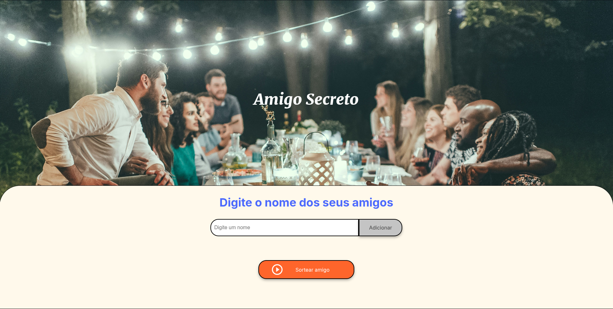

# Amigo Secreto 🎉

Este projeto é uma aplicação simples em HTML, CSS e JavaScript para facilitar o sorteio de amigos secretos. A interface é intuitiva e funcional, permitindo adicionar nomes de participantes, visualizar a lista de amigos e sortear um deles aleatoriamente.

## Funcionalidades ✨

### 1. Adicionar Nomes ➕

- O usuário pode inserir os nomes dos participantes no campo de texto e adicioná-los à lista clicando no botão Adicionar.

- Os nomes são exibidos em uma lista visível na página, garantindo que todos os participantes sejam listados corretamente.

### 2. Sortear Amigo Secreto 🎲

- Após adicionar os nomes, o usuário pode clicar no botão Sortear amigo para selecionar aleatoriamente um dos participantes.

- O nome sorteado será exibido abaixo da lista, destacando o resultado.

### 3. Interface Amigável 🖥️

- A interface é clara e simples, projetada para facilitar a interação.

- O design responsivo adapta-se a diferentes tamanhos de tela, tornando o aplicativo utilizável tanto em desktops quanto em dispositivos móveis.

## Tecnologias Utilizadas 🛠️

- HTML5: Estrutura da aplicação.

- CSS3: Estilização visual, incluindo alinhamento, posicionamento e fontes.

- JavaScript: Funcionalidade para manipular o DOM, armazenar os nomes em um array e realizar o sorteio aleatório.

## Estrutura do Projeto 📂

- index.html: Arquivo principal contendo a estrutura da página.

- style.css: Arquivo de estilo responsável pelo design visual.

- app.js: Arquivo JavaScript para lógica da aplicação.

## Como Usar 📝

1. Clone ou baixe o repositório para sua máquina local.

`git clone https://github.com/seu-usuario/amigo-secreto.git`

2. Abra o arquivo index.html em um navegador de sua escolha.

3. Digite os nomes dos participantes no campo de entrada e clique em Adicionar.

4. Após adicionar todos os nomes, clique em Sortear amigo para selecionar um nome aleatório.

## Personalização 🎨

Você pode alterar o design modificando o arquivo style.css.

Para adicionar funcionalidades extras ou modificar a lógica do sorteio, edite o arquivo app.js.

Prévia 🖼️

Aqui está uma captura de tela da interface:

## Licença 📜

Este projeto está licenciado sob a MIT License. Você pode usá-lo livremente, com ou sem modificações.

Divirta-se com seu sorteio de amigo secreto! 🎁
